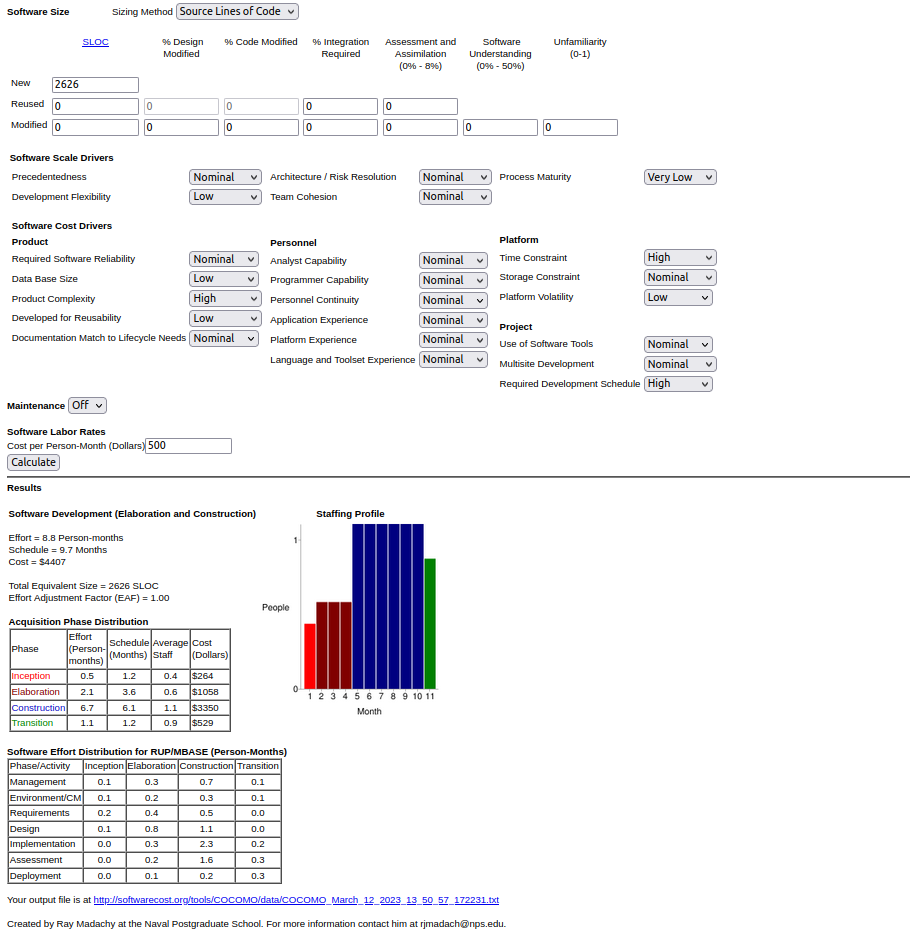

# :yellow_square: Predlog projekta

|                             |                                                                |
| :-------------------------- | :------------------------------------------------------------- |
| **Naziv projekta**          | Aplikacija produktivnosti in organizacije                               |
| **Člani projektne skupine** | Arne Gašperšič, Jan Merhar, Jure Mržek, Anže Rifelj Tričkovič, Klemen Kolar |
| **Kraj in datum**           | Ljubljana,                      10.3.2023           |

## Povzetek projekta

:dart: **TO-DO**

- V približno 150 - 250 besedah povzemite cilje projekta in pričakovane rezultate.
- V povzetku naj bo jasno razvidna problemska domena, s katero se boste v okviru projekta ukvarjali.

Cilji našega projekta so v grobem razviti aplikacijo ki deluje kot socialno omrežje in pomaga ljudem z organizacijo dela. Pričakujemo, da bodo ljudje našo aplikacijo uporabljali vsakodnevno za organizacijo svojega dela bodisi za šolo, službo, faks ali pa tudi pri domačih opravilih in podobno. V aplikaciji bodo tudi vključene funkcionalnosti socialnega omrežja, kjer bodo lahko prijatelji med seboj spremljali učinkovitost, kar jih bo tudi dodatno spodbudilo k delu in organizaciji le tega. Aplikacijo bomo tudi povezali z Google koledarjem z namenom, da ljudem olajšamo uporabo in jih s tem tudi dodatno motiviramo za uporabo naše aplikacije. Pričakujemo, da bodo naši uporabniki ostali aktivni dalj časa, saj je naša rešitev namenjena dolgotrajni uporabi. Sproti bomo seveda tudi skrbeli za odpravljanje hroščev, kateri bi lahko uporabnike odvrnili od nadaljne uporabe. S tem namenom bomo tudi implementirali možnosti za sporočanje napak s strani uporabnikov do nas razvijalcev, za možnost čimprejšnjega odpravljanja le teh.

## 1. Projektna ideja

### 1.1 Ozadje

:dart: **TO-DO**

- Opis problemske domene oziroma konteksta projekta (neposredno se ne tiče projekta).
- Kaj do sedaj že obstaja, oziroma kaj se na področju dogaja.
- Gre za področje za katerega se bo izdelala rešitev predstavljena v Predlogu projekta.

Neučinkovita organizacija je pri ljudeh pogost problem. Od napotnic in rojstnih dni do novoletnih zaobljub, ki jih moramo usklajevati. Na področju produktivnosti obstaja več aplikacij (Forest, Focus To-Do, Google tasks…) , ki uporabniku pomagajo spremljati svojo aktivnost in napredek, vendar se ne osredotočajo na pogled socialnega omrežja, temveč delujejo bolj individualno.

### 1.2 Področje in motivacija

:dart: **TO-DO**

- Kaj vas motivira, da ste se odločili za projekt?
- Zakaj se vam zdi smiselno, da izbrano problemsko domeno podprete s programsko rešitvijo?
- V čem se vaša rešitev razlikuje od sorodnih rešitev, ki morebiti že obstajajo?
- Ste v kakšnem pogledu posebni, morda edinstveni?
- Kakšno ciljno publiko naslavljate s svojim projektom?
- S čim boste tipičnega predstavnika ciljne publike prepričali, da bo vaš izdelek uporabljal ali celo kupil?

Kot študenti se tudi sami pogosto srečamo s problemom motivacija in pomanjkanje organizacije, zato smo se odločili razviti projektno idejo v tej smeri. Problemsko domeno smo se odličili podpreti s programsko opremo, ker imajo ljudje dandanes pri sebi vedno mobilne telefone preko katerih bi organizacija potekala najbolj učinkovito in hitro.
Podobne ideje socialnih omrežji in aplikacij za produktivnost obstajajo, vendar ne ponujajo združenega produkta. Z našo idejo želimo doseči, da bi socialni aspekt ljudi prepričal v bolj aktivno sledenje svojim dolgoročnim ciljem.
Naša ciljna publika so ljudje, ki želijo enostaven način za organizacijo in si lahko z našim sistemom organizirajo delo in sledijo svojem napredku.

### 1.3 Namen

:dart: **TO-DO**

- Kakšne koristi ima lahko projekt za organizacijo, stroko, znanost?
- Kaj nameravamo s projektom doseči?
- Kakšne probleme bomo rešili?
- Kaj bodo uporabniki sposobni narediti bolje?

Namen projekta je ustvariti aplikacijo, ki bo ljudi spodbujala k bolj produktivnemu življenju in da bi jo uporabljalo čim več ljudi iz naše ciljne publike. S tem projektom rešujemo problem slabe organizacije in neproduktivnosti pri delu. Z uporabo naše aplikacije bodo uporabniki lahko planirali svoj dnevni urnik učinkovito in enostavno, tako da bodo dosegli maksimalno učinkovitost.

### 1.4 Cilji

:dart: **TO-DO**

- Navedite, kaj bodo konkretni izdelki/storitve vašega projekta.
- Cilji morajo biti merljivi in preverljivi.

Sistem ponuja vnos osebnih ciljev, dogodkov in načrtov, na katere bo nato opozarjal uporabnika in mu pomagal pri izpolnjevanju le teh. Omogoča dodajanje prijateljev in izbiro privatnosti, da lahko uporabniki med seboj primerjajo svoje statistike. Podobne ideje socialnih omrežji in aplikacij za produktivnost obstajajo, vendar ne ponujajo združenega produkta. Uporablja google calendar.....itd

### 1.5 Smernice za rešitev

:dart: **TO-DO**

- Opredelite smernice, ki naj bi se jih v okviru izvajanja projekta držali.
- Smernice se lahko nanašajo na izvedbo projekta ali na sam izdelek projekta.

V okviru priprave in razvoja aplikacije, se nameravamo držati sledečih smernic:
- Aplikacija zbira osebne podatke, zato moramo zagotoviti visoko raven varovanja.
- Google koledar vključimo v kodo z mislijo, da bo tudi naslednja verzija delovala brez dodatnega programiranja
- Aplikacija deluje za Android sistem, Windows, Mac, linux in web interface
- Vse funkcionalnosti razvijamo v istem programskem jeziku

### 1.6 Končni uporabniki

:dart: **TO-DO**

- Kdo so končni uporabniki sistema?
- Koliko bo končnih uporabnikov?
- Kakšna znanja imajo?
- Kdo bo imel koristi od projekta, ne da bi bil neposredno vključen?

Ciljni uporabniki naše rešitve so predvsem dijaki, študenti in zaposleni, ki še vedno razvijajo svojo kariero, saj si lahko z našim sistemom organizirajo delo in sledijo svojem napredku. Imajo osnovno (uporabniško) predznanje. To je dovolj za uporabo naše aplikacije, saj bo realizirana z razumljivimi uporabniškimi umesniki. Pričakujemo konstantno rast uporabnikov po 40 na mesec.

## 2. Projektni načrt

### 2.1 Povzetek razdelitve projekta na aktivnosti

:dart: **TO-DO**

- Na kratko povzemite razdelitev projekta na aktivnosti.
- Aktivnost je smiselno zaokrožena enota dela z jasno opredeljenimi cilji.
- Aktivnosti so med sabo lahko odvisne: preden pričnemo izvajati neko aktivnost, morajo biti zaključene nekatere druge aktivnosti.

Aktivnosti, ki smo jih definirali, spadajo k načrtovanju projekta in samem razvoju projekta. Preden začnemo z razvojem potrebujemo zaključiti z aktivnostmi, ki se navezujejo na načrtovanje, saj so med seboj odvisne. V spodnjih tabelah smo zbrali vse aktivnosti, ki bodo opredeljevale naš projekt in vse njihove podatke (datum pričetka, datum zaključka, naziv aktivnosti, obseg v ČM, trajanje, seznam ciljev, opis aktivnosti, morebitne medsebojne odvisnosti in izdelki, ki nastanejo ob zaključku aktivnosti).

### 2.2 Načrt posameznih aktivnosti

| **Oznaka aktivnosti**                               | A1                                                                                                              |
| :-------------------------------------------------- | :--------------------------------------------------------------------------------------------------------------------------------------------------- |
| **Predvideni datum pričetka izvajanja aktivnosti**  | 13.3.2023                                                                                                                            |
| **Predvideni datum zaključka izvajanja aktivnosti** | 14.3.2023                                                                                                                             |
| **Trajanje**                                        |           1 dan                                                                                                          |
| **Naziv aktivnosti**                                | Izbira ustrezne arhitekture                                                                                                               |
| **Obseg aktivnosti v ČM**                           | 0,25 ČM                                                                                                       |
| **Seznam ciljev aktivnosti (kaj želite doseči)**    | S člani dosežen dogovor o arhitekturi, določena tehnologija in orodja                                                                                                       |
| **Opis aktivnosti**                                 | Debata o prednostih in slabostih določenih tehnologij in orodij za izdelavo projekta, na koncu se izbere najustreznejša.                                                                               |
| **Morebitne odvisnosti in omejitve**                | |
| **Pričakovani rezultati aktivnosti**                |                                                                                             |

| **Oznaka aktivnosti**                               | A2                                                                                                              |
| :-------------------------------------------------- | :--------------------------------------------------------------------------------------------------------------------------------------------------- |
| **Predvideni datum pričetka izvajanja aktivnosti**  | 14.3.2023                                                                                                                            |
| **Predvideni datum zaključka izvajanja aktivnosti** | 16.3.2023                                                                                                                             |
| **Trajanje**                                        |           3 dni                                                                                                          |
| **Naziv aktivnosti**                                | Izbira izgleda aplikacije                                                                                                               |
| **Obseg aktivnosti v ČM**                           | 0,375 ČM                                                                                                   |
| **Seznam ciljev aktivnosti (kaj želite doseči)**    | Jasno postavljen izgled aplikacije s katerim se strinjajo vsi člani.                                                                                                       |
| **Opis aktivnosti**                                 | Debatiramo o zunanjem izgledu aplikacije, na list ali s kakšnim orodjem si poskusamo predstaviti izgled in se na koncu odločiti za najbolj ustreznega.                                                                          |
| **Morebitne odvisnosti in omejitve**                | |
| **Pričakovani rezultati aktivnosti**                |     

| **Oznaka aktivnosti**                               | A3                                                                                                              |
| :-------------------------------------------------- | :--------------------------------------------------------------------------------------------------------------------------------------------------- |
| **Predvideni datum pričetka izvajanja aktivnosti**  | 15.3.2023                                                                                                                            |
| **Predvideni datum zaključka izvajanja aktivnosti** | 16.3.2023                                                                                                                             |
| **Trajanje**                                        |           2 dni                                                                                                          |
| **Naziv aktivnosti**                                | Določitev uporabniških vlog                                                                                                            |
| **Obseg aktivnosti v ČM**                           | 0,25 ČM                                                                                                     |
| **Seznam ciljev aktivnosti (kaj želite doseči)**    | Jasno določene uporabniške vloge in njihove funkcionalnosti.                                                                                                      |
| **Opis aktivnosti**                                 | Razmišlja se o uporabniških vlogah, ki bi bile ustrezne za izvedbo naše aplikacije.                                                                               |
| **Morebitne odvisnosti in omejitve**                | |
| **Pričakovani rezultati aktivnosti**                |     

| **Oznaka aktivnosti**                               | A4                                                                                                              |
| :-------------------------------------------------- | :--------------------------------------------------------------------------------------------------------------------------------------------------- |
| **Predvideni datum pričetka izvajanja aktivnosti**  | 17.3.2023                                                                                                                            |
| **Predvideni datum zaključka izvajanja aktivnosti** | 20.3.2023                                                                                                                             |
| **Trajanje**                                        |           4 dni(za vikend ne delamo)                                                                                                          |
| **Naziv aktivnosti**                                | Načrtovanje transakcijske baze                                                                                                               |
| **Obseg aktivnosti v ČM**                           | 0,25 ČM                                                                                                   |
| **Seznam ciljev aktivnosti (kaj želite doseči)**    | Jasno zasnovan načrt transakcijske baze s katerim si bomo pomagali pri implementaciji.                                                                                                     |
| **Opis aktivnosti**                                 | S člani iščemo najboljše rešitve za izdelavo transakcijske baze s pomočjo uporabniških vlog, ki smo jih že določili in izberemo najustreznejšo.                                                                              |
| **Morebitne odvisnosti in omejitve**                | Zaključeno delo na A3 |
| **Pričakovani rezultati aktivnosti**                |     

| **Oznaka aktivnosti**                               | A5                                                                                                              |
| :-------------------------------------------------- | :--------------------------------------------------------------------------------------------------------------------------------------------------- |
| **Predvideni datum pričetka izvajanja aktivnosti**  | 20.3.2023                                                                                                                            |
| **Predvideni datum zaključka izvajanja aktivnosti** | 21.3.2023                                                                                                                             |
| **Trajanje**                                        |           2 dni                                                                                                          |
| **Naziv aktivnosti**                                | Načrtovanje podatkovnega skladišča                                                                                                               |
| **Obseg aktivnosti v ČM**                           | 0,25 ČM                                                                                                     |
| **Seznam ciljev aktivnosti (kaj želite doseči)**    | Jasno zasnovan načrt podatkovnega skladišča s katerim si bomo pomagali pri implementaciji.                                                                                                    |
| **Opis aktivnosti**                                 | S člani iščemo najboljše rešitve za izdelavo podatkovnega skladišča in izberemo najustreznejšo.                                                                               |
| **Morebitne odvisnosti in omejitve**                | |
| **Pričakovani rezultati aktivnosti**                |     

| **Oznaka aktivnosti**                               | A6                                                                                                              |
| :-------------------------------------------------- | :--------------------------------------------------------------------------------------------------------------------------------------------------- |
| **Predvideni datum pričetka izvajanja aktivnosti**  | 22.3.2023                                                                                                                            |
| **Predvideni datum zaključka izvajanja aktivnosti** | 27.3.2023                                                                                                                             |
| **Trajanje**                                        |           6 dni(za vikend ne delamo)                                                                                                          |
| **Naziv aktivnosti**                                | Izdelava zaslonskih mask                                                                                                               |
| **Obseg aktivnosti v ČM**                           | 0,5 ČM                                                                                                |
| **Seznam ciljev aktivnosti (kaj želite doseči)**    | V celoti implementirane zaslonske maske.                                                                                                    |
| **Opis aktivnosti**                                 | V že določeni tehnologiji in z že določenimi orodji programiramo zaslonske maske.                                                                               |
| **Morebitne odvisnosti in omejitve**                | Zaključeno delo na A1 in A2 (ko končamo graf PERT še za vsako aktivnost tu povemo če je na kritični poti)|
| **Pričakovani rezultati aktivnosti**                | Zaslonske maske    

| **Oznaka aktivnosti**                               | A7                                                                                                              |
| :-------------------------------------------------- | :--------------------------------------------------------------------------------------------------------------------------------------------------- |
| **Predvideni datum pričetka izvajanja aktivnosti**  | 28.3.2023                                                                                                                            |
| **Predvideni datum zaključka izvajanja aktivnosti** | 30.3.2023                                                                                                                             |
| **Trajanje**                                        |           3 dni                                                                                                          |
| **Naziv aktivnosti**                                | Izdelava transakcijske baze                                                                                                               |
| **Obseg aktivnosti v ČM**                           | 0,375 ČM                                                                                                         |
| **Seznam ciljev aktivnosti (kaj želite doseči)**    | Delujoča in stabilna transakcijska podatkovna baza.                                                                                                    |
| **Opis aktivnosti**                                 | Programiramo transakcijsko podatkovno bazo v ustrezni arhitekturi in po načrtu, ki smo ga sestavili vnaprej.                                                                               |
| **Morebitne odvisnosti in omejitve**                | Zaključeno delo na A1 in A4 |
| **Pričakovani rezultati aktivnosti**                |     Transakcijska podatkovna baza

| **Oznaka aktivnosti**                               | A8                                                                                                              |
| :-------------------------------------------------- | :--------------------------------------------------------------------------------------------------------------------------------------------------- |
| **Predvideni datum pričetka izvajanja aktivnosti**  | 30.3.2023                                                                                                                            |
| **Predvideni datum zaključka izvajanja aktivnosti** | 3.4.2023                                                                                                                             |
| **Trajanje**                                        |     5 dni (za vikend ne delamo)                                                                                                          |
| **Naziv aktivnosti**                                | Izdelava podatkovnega skladišča                                                                                                               |
| **Obseg aktivnosti v ČM**                           | 0,375 ČM                                                                                                        |
| **Seznam ciljev aktivnosti (kaj želite doseči)**    | Delujoče in stabilno podatkovno skladišče, ki ga bomo lahko povezali z aplikacijo.                                                                                                    |
| **Opis aktivnosti**                                 | Programiramo podatkovno skladišče v ustrezni arhitekturi in po načrtu, ki smo ga sestavili vnaprej.                                                                               |
| **Morebitne odvisnosti in omejitve**                | Zaključeno delo na A1 in A5|
| **Pričakovani rezultati aktivnosti**                | Podatkovno skladišče    

| **Oznaka aktivnosti**                               | A9                                                                                                              |
| :-------------------------------------------------- | :--------------------------------------------------------------------------------------------------------------------------------------------------- |
| **Predvideni datum pričetka izvajanja aktivnosti**  | 3.4.2023                                                                                                                            |
| **Predvideni datum zaključka izvajanja aktivnosti** | 5.4.2023                                                                                                                             |
| **Trajanje**                                        |     3 dni                                                                                                          |
| **Naziv aktivnosti**                                | Implementacija prijave in registracije                                                                                                               |
| **Obseg aktivnosti v ČM**                           | 0,375 ČM                                                                                                        |
| **Seznam ciljev aktivnosti (kaj želite doseči)**    | Delujoče okno za prijavo in registracijo, ki uspešno komunicira z transakcijsko bazo podatkov.                                                                                                    |
| **Opis aktivnosti**                                 | Programiramo registracijo in prijavo uporabnikov na podlagi zasnovanih zaslonskih mask in podatkovne baze, ki smo jo že implementirali.                                                                               |
| **Morebitne odvisnosti in omejitve**                | Zaključeno delo na A6 in A7|
| **Pričakovani rezultati aktivnosti**                | Delujoče okno za prijavo in registracijo

| **Oznaka aktivnosti**                               | A10                                                                                                              |
| :-------------------------------------------------- | :--------------------------------------------------------------------------------------------------------------------------------------------------- |
| **Predvideni datum pričetka izvajanja aktivnosti**  | 6.4.2023                                                                                                                            |
| **Predvideni datum zaključka izvajanja aktivnosti** | 7.4.2023                                                                                                                             |
| **Trajanje**                                        |     2 dni                                                                                                          |
| **Naziv aktivnosti**                                | Implementacija obnovitve pozabljenega gesla                                                                                                               |
| **Obseg aktivnosti v ČM**                           | 0,25 ČM                                                                                                        |
| **Seznam ciljev aktivnosti (kaj želite doseči)**    | Gumb na oknu prijave in registracije, ki tudi pravilno komunicira s transakcijsko bazo podatkov.                                                                                                    |
| **Opis aktivnosti**                                 | Implementiramo obnovitev pozabljenega gesla na podlagi že implementirane prijave in registracije.                                                                               |
| **Morebitne odvisnosti in omejitve**                | Zaključeno delo na A9|
| **Pričakovani rezultati aktivnosti**                |   Delujoč gumb za obnovitev gesla

| **Oznaka aktivnosti**                               | A11                                                                                                              |
| :-------------------------------------------------- | :--------------------------------------------------------------------------------------------------------------------------------------------------- |
| **Predvideni datum pričetka izvajanja aktivnosti**  | 11.4.2023                                                                                                                            |
| **Predvideni datum zaključka izvajanja aktivnosti** | 13.4.2023                                                                                                                             |
| **Trajanje**                                        |     3 dni                                                                                                          |
| **Naziv aktivnosti**                                | Implementacija iskanja prijateljev                                                                                                               |
| **Obseg aktivnosti v ČM**                           | 0,375 ČM                                                                                                         |
| **Seznam ciljev aktivnosti (kaj želite doseči)**    | Delujoč iskalnik, ki komunicira z bazo.                                                                                                    |
| **Opis aktivnosti**                                 | Programiramo iskalnik za dodajanje prijateljev, ki uporablja že implementirano transakcijsko podatkovno bazo.                                                                               |
| **Morebitne odvisnosti in omejitve**                | Zaključeno delo na A6 in A7|
| **Pričakovani rezultati aktivnosti**                |   Delujoč iskalnik za dodajanje prijateljev

| **Oznaka aktivnosti**                               | A12                                                                                                              |
| :-------------------------------------------------- | :--------------------------------------------------------------------------------------------------------------------------------------------------- |
| **Predvideni datum pričetka izvajanja aktivnosti**  | 11.4.2023                                                                                                                            |
| **Predvideni datum zaključka izvajanja aktivnosti** | 11.4.2023                                                                                                                             |
| **Trajanje**                                        |     1 dan                                                                                                          |
| **Naziv aktivnosti**                                | Implementacija shranjevanja dogodkov uporabnika                                                                                                               |
| **Obseg aktivnosti v ČM**                           | 0,125 ČM                                                                                                         |
| **Seznam ciljev aktivnosti (kaj želite doseči)**    | Delujoče shranjevanje dogodkov, ki jih uporabnik vnese.                                                                                                    |
| **Opis aktivnosti**                                 | Z že delujočo transakcijsko bazo podatkov povežemo shranjevanje dogodkov.                                                                               |
| **Morebitne odvisnosti in omejitve**                | Zaključeno delo na A7|
| **Pričakovani rezultati aktivnosti**                | 

| **Oznaka aktivnosti**                               | A13                                                                                                              |
| :-------------------------------------------------- | :--------------------------------------------------------------------------------------------------------------------------------------------------- |
| **Predvideni datum pričetka izvajanja aktivnosti**  | 11.4.2023                                                                                                                            |
| **Predvideni datum zaključka izvajanja aktivnosti** | 17.4.2023                                                                                                                             |
| **Trajanje**                                        |     7 dni (za vikend ne delamo)                                                                                                          |
| **Naziv aktivnosti**                                | Implementacija vmesnika določanja navad                                                                                                               |
| **Obseg aktivnosti v ČM**                           | 0,375 ČM                                                                                                         |
| **Seznam ciljev aktivnosti (kaj želite doseči)**    | Delujoča vnosna polja za določanje navad.                                                                                                    |
| **Opis aktivnosti**                                 | Programiramo vmesnik za dodajanje dodajanje navad in dolgoročnih ciljev na katere nas aplikacija opominja, ki uporablja že implementirano transakcijsko podatkovno bazo.                                                                               |
| **Morebitne odvisnosti in omejitve**                | Zaključeno delo na A6 in A7|
| **Pričakovani rezultati aktivnosti**                |   Delujoča vnosna polja za določanje navad

| **Oznaka aktivnosti**                               | A14                                                                                                              |
| :-------------------------------------------------- | :--------------------------------------------------------------------------------------------------------------------------------------------------- |
| **Predvideni datum pričetka izvajanja aktivnosti**  | 17.4.2023                                                                                                                            |
| **Predvideni datum zaključka izvajanja aktivnosti** | 19.4.2023                                                                                                                             |
| **Trajanje**                                        |     3 dni                                                                                                          |
| **Naziv aktivnosti**                                | Implementacija časovnika in njegovega urejanja                                                                                                               |
| **Obseg aktivnosti v ČM**                           | 0,375 ČM                                                                                                         |
| **Seznam ciljev aktivnosti (kaj želite doseči)**    | Delujoč časovnik za določanje časa za delo in pavze in njegovo urejanje.                                                                                                    |
| **Opis aktivnosti**                                 | Programiramo časovnik kot smo si ga zamislili pri načrtovanju.                                                                               |
| **Morebitne odvisnosti in omejitve**                | Zaključeno delo na A6|
| **Pričakovani rezultati aktivnosti**                | Delujoč časovnik

| **Oznaka aktivnosti**                               | A15                                                                                                              |
| :-------------------------------------------------- | :--------------------------------------------------------------------------------------------------------------------------------------------------- |
| **Predvideni datum pričetka izvajanja aktivnosti**  | 17.4.2023                                                                                                                            |
| **Predvideni datum zaključka izvajanja aktivnosti** | 20.4.2023                                                                                                                             |
| **Trajanje**                                        |     4 dni                                                                                                          |
| **Naziv aktivnosti**                                | Implementacija Google koledarja preko API-ja                                                                                                               |
| **Obseg aktivnosti v ČM**                           | 0,5 ČM                                                                                                         |
| **Seznam ciljev aktivnosti (kaj želite doseči)**    | Delujoč vmesnik za uporabo Google koledarja v aplikaciji                                                                                                   |
| **Opis aktivnosti**                                 | Delo na implementaciji Google koledarja preko API-ja                                                                                |
| **Morebitne odvisnosti in omejitve**                | Zaključeno delo na A6 |
| **Pričakovani rezultati aktivnosti**                | Delujoča uporaba Google koledarja preko aplikacije

| **Oznaka aktivnosti**                               | A16                                                                                                              |
| :-------------------------------------------------- | :--------------------------------------------------------------------------------------------------------------------------------------------------- |
| **Predvideni datum pričetka izvajanja aktivnosti**  | 21.4.2023                                                                                                                            |
| **Predvideni datum zaključka izvajanja aktivnosti** | 24.4.2023                                                                                                                             |
| **Trajanje**                                        |     4 dni (čez vikend ne delamo)                                                                                                          |
| **Naziv aktivnosti**                                | Implementacija urejanja dogodkov na Google koledarju                                                                                                               |
| **Obseg aktivnosti v ČM**                           | 0,25 ČM                                                                                                        |
| **Seznam ciljev aktivnosti (kaj želite doseči)**    | Delujoč vmesnik za urejanje dogodkov na Google koledarju, ki smo ga že integrirali.                                                                                                   |
| **Opis aktivnosti**                                 | Delo na implementaciji urejanja dogodkov na Google koledarju, ki smo ga že predhodno integrirali v našo aplikacijo.                                                                                |
| **Morebitne odvisnosti in omejitve**                | Zaključeno delo na A15 |
| **Pričakovani rezultati aktivnosti**                | Delujoč vmesnik za urejanje dogodkov na Google koledarju.

| **Oznaka aktivnosti**                               | A17                                                                                                              |
| :-------------------------------------------------- | :--------------------------------------------------------------------------------------------------------------------------------------------------- |
| **Predvideni datum pričetka izvajanja aktivnosti**  | 24.4.2023                                                                                                                            |
| **Predvideni datum zaključka izvajanja aktivnosti** | 26.4.2023                                                                                                                             |
| **Trajanje**                                        |     3 dni                                                                                                          |
| **Naziv aktivnosti**                                |  Implementacija beleženja aktivnosti in prenosa iz transakcijske baze v podatkovno skladišče                                                                                                        |
| **Obseg aktivnosti v ČM**                           | 0,375 ČM                                                                                                         |
| **Seznam ciljev aktivnosti (kaj želite doseči)**    | Beleženje aktivnosti v podatkovni bazi in prenos teh podatkov v skladišče.         |
| **Opis aktivnosti**                                 | Delo na izdelavi beleženja aktivnosti in prenosa na podlagi že implementirane transakcijske podatkovne baze in podatkovnega skladišča.   |
| **Morebitne odvisnosti in omejitve**                | Zaključeno delo na A7 in A8 |
| **Pričakovani rezultati aktivnosti**                | Delujoče beleženje aktivnosti in prenos iz transakcijske baze v podatkovno skladišče

| **Oznaka aktivnosti**                               | A18                                                                                                              |
| :-------------------------------------------------- | :--------------------------------------------------------------------------------------------------------------------------------------------------- |
| **Predvideni datum pričetka izvajanja aktivnosti**  | 28.4.2023                                                                                                                            |
| **Predvideni datum zaključka izvajanja aktivnosti** | 8.5.2023                                                                                                                             |
| **Trajanje**                                        |     11 dni (za vikend in praznike ne delamo)                                                                                                         |
| **Naziv aktivnosti**                                |  Implementacija grafičnega prikaza statistik uporabnika in njegovih prijateljev                                                                                                        |
| **Obseg aktivnosti v ČM**                           | 0,625 ČM                                                                                                       |
| **Seznam ciljev aktivnosti (kaj želite doseči)**    | Delujoč grafični prikaz statistik, ki komunicira s transakcijsko podatkovno bazo in podatkovnim skladiščem.         |
| **Opis aktivnosti**                                 | Delo na izdelavi grafičnega prikaza statistik uporabnika in njegovih prijateljev na podlagi že implementirane transakcijske podatkovne baze, podatkovnega skladišča in zaslonskih mask.   |
| **Morebitne odvisnosti in omejitve**                | Zaključeno delo na A6 in A17 |
| **Pričakovani rezultati aktivnosti**                | Delujoč grafični prikaz statistik uporabnika in  njegovih prijateljev

| **Oznaka aktivnosti**                               | A19                                                                                                              |
| :-------------------------------------------------- | :--------------------------------------------------------------------------------------------------------------------------------------------------- |
| **Predvideni datum pričetka izvajanja aktivnosti**  | 28.4.2023                                                                                                                            |
| **Predvideni datum zaključka izvajanja aktivnosti** | 28.4.2023                                                                                                                             |
| **Trajanje**                                        |     1 dan                                                                                                        |
| **Naziv aktivnosti**                                |  Implementacija ogleda aktivnosti prijateljev                                                                                                        |
| **Obseg aktivnosti v ČM**                           | 0,25 ČM                                                                                                         |
| **Seznam ciljev aktivnosti (kaj želite doseči)**    | Delujoč prikaz trenutnih aktivnosti, ki jih beležimo v bazi, prijateljev, ki jih lahko dodamo z iskalnikom prijateljev.         |
| **Opis aktivnosti**                                 | Programiranje ogleda trenutnih aktivnosti prijateljev z že implementiranjem beleženjem aktivnosti.   |
| **Morebitne odvisnosti in omejitve**                | Zaključeno delo na A6 in A17 |
| **Pričakovani rezultati aktivnosti**                | Delujoč prikaz aktivnosti prijateljev 

| **Oznaka aktivnosti**                               | A20                                                                                                              |
| :-------------------------------------------------- | :--------------------------------------------------------------------------------------------------------------------------------------------------- |
| **Predvideni datum pričetka izvajanja aktivnosti**  | 3.5.2023                                                                                                                            |
| **Predvideni datum zaključka izvajanja aktivnosti** | 5.5.2023                                                                                                                             |
| **Trajanje**                                        |     3 dni                                                                                                        |
| **Naziv aktivnosti**                                |  Implementacija urejanja uporabniškega računa                                                                                                       |
| **Obseg aktivnosti v ČM**                           | 0,375 ČM                                                                                                         |
| **Seznam ciljev aktivnosti (kaj želite doseči)**    | Delujoč vmesnik za urejanje računa, ki komunicira s transakcijsko podatkovno bazo.         |
| **Opis aktivnosti**                                 | Programiranje vmesnika za urejanje uporabniškega računa(posodobitev gesla in ostalih atributov) na podlagi že izdelanih zaslonskih mask in vzpostavljene transakcijske podatkovne baze.   |
| **Morebitne odvisnosti in omejitve**                | Zaključeno delo na A6 in A7 |
| **Pričakovani rezultati aktivnosti**                | Delujoč vmesnik za urejanje uporabniškega računa

| **Oznaka aktivnosti**                               | A21                                                                                                              |
| :-------------------------------------------------- | :--------------------------------------------------------------------------------------------------------------------------------------------------- |
| **Predvideni datum pričetka izvajanja aktivnosti**  | 8.5.2023                                                                                                                            |
| **Predvideni datum zaključka izvajanja aktivnosti** | 11.5.2023                                                                                                                             |
| **Trajanje**                                        |     4 dni                                                                                                        |
| **Naziv aktivnosti**                                |  Implementacija vmesnika za poročanje o napakah                                                                                                        |
| **Obseg aktivnosti v ČM**                           | 0,5 ČM                                                                                                         |
| **Seznam ciljev aktivnosti (kaj želite doseči)**    | Delujoč vmesnik, ki v podatkovni bazi hrani poročila, ki jih bo lahko pregledal administrator.        |
| **Opis aktivnosti**                                 |Programiranje vmesnika za poročanje o napakah delovanja aplikacije (hroščev v kodi) na podlagi že izdelanih zaslonskih mask in vzpostavljene transakcijske podatkovne baze.   |
| **Morebitne odvisnosti in omejitve**                | Zaključeno delo na A6 in A7 |
| **Pričakovani rezultati aktivnosti**                | Delujoč vmesnik za poročanje o napakah

| **Oznaka aktivnosti**                               | A22                                                                                                              |
| :-------------------------------------------------- | :--------------------------------------------------------------------------------------------------------------------------------------------------- |
| **Predvideni datum pričetka izvajanja aktivnosti**  | 12.5.2023                                                                                                                            |
| **Predvideni datum zaključka izvajanja aktivnosti** | 17.5.2023                                                                                                                             |
| **Trajanje**                                        |     6 dni (za vikend ne delamo)                                                                                                       |
| **Naziv aktivnosti**                                |  Implementacija vmesnika za upravljanje poročil o nepravilnem delovanju                                                                                                        |
| **Obseg aktivnosti v ČM**                           | 0,5 ČM                                                                                                         |
| **Seznam ciljev aktivnosti (kaj želite doseči)**    | Delujoč vmesnik za upravljanje poročil, ki iz podatkovne baze prikaže poslana poročila o nepravilnem delovanju, za administratorja aplikacije.        |
| **Opis aktivnosti**                                 |Programiranje vmesnika za upravljanje poročil o nepravilnem delovanju na podlagi transakcijske podatkovne baze in zaslonskih mask, ki smo jih že sprogramirali.   |
| **Morebitne odvisnosti in omejitve**                | Zaključeno delo na A6 in A7 |
| **Pričakovani rezultati aktivnosti**                | Delujoč vmesnik za upravljanje poročil o nepravilnem delovanju

| **Oznaka aktivnosti**                               | A23                                                                                                              |
| :-------------------------------------------------- | :--------------------------------------------------------------------------------------------------------------------------------------------------- |
| **Predvideni datum pričetka izvajanja aktivnosti**  | 13.3.2023                                                                                                                            |
| **Predvideni datum zaključka izvajanja aktivnosti** | 21.5.2023                                                                                                                             |
| **Trajanje**                                        |     70 dni (brez vikendov)                                                                                                        |
| **Naziv aktivnosti**                                |  Upravljanje projekta                                                                                                        |
| **Obseg aktivnosti v ČM**                           | 1,25 ČM                                                                                                         |
| **Seznam ciljev aktivnosti (kaj želite doseči)**    | Uspešno voden projekt z uspešno dokončano končno aplikacijo |
| **Opis aktivnosti**                                 | Projektni vodja vodi projekt in nadzoruje, da se vsi člani držijo pripravljenega načrta |
| **Morebitne odvisnosti in omejitve**                |  |
| **Pričakovani rezultati aktivnosti**                | 

### 2.3 Seznam izdelkov

V obliki zbirne table prikažite izdelke vseh aktivnosti, kjer lahko uporabite naslednjo tabelo:

| Oznaka izdelka   | Ime izdelka      | Datum izdaje     |
| :--------------- | :--------------- | :--------------- |
| I1| Zaslonske maske | 27.3.2023 |
| I2|Transakcijska podatkovna baza|30.3.2023|
| I3|Podatkovno skladišče|3.4.2023|
| I4|Delujoče okno za prijavo in registracijo|5.4.2023|
| I5|	Delujoč gumb za obnovitev gesla|7.4.2023|
| I6|Delujoč iskalnik za dodajanje prijateljev|12.4.2023|
| I7|Delujoča vnosna polja za določanje navad|14.4.2023|
| I8|Delujoč časovnik|19.4.2023|
| I9|Delujoča uporaba Google koledarja preko aplikacije|20.4.2023|
| I10|Delujoč vmesnik za urejanje dogodkov na Google koledarju|24.4.2023|
| I11|Delujoče beleženje aktivnosti in prenos iz transakcijske baze v podatkovno skladišče|26.4.2023|
| I12|Delujoč grafični prikaz statistik uporabnika in njegovih prijateljev|3.5.2023|
| I13|Delujoč prikaz aktivnosti prijateljev|28.4.2023|
| I14|Delujoč vmesnik za urejanje uporabniškega računa|5.5.2023|
| I15|Delujoč vmesnik za poročanje o napakah|11.5.2023|
| I16|Delujoč vmesnik za upravljanje poročil o nepravilnem delovanju|17.5.2023|

### 2.4 Časovni potek projekta - Ganttov diagram

:dart: **TO-DO**

- Obdobja izvajanja posameznih aktivnosti prikažite v obliki **Ganttovega diagrama**.
- Za izdelavo uporabite ogrodje PlantUML, in sicer [Gantt Diagram](https://plantuml.com/gantt-diagram).
- V poročilo vključite **izvorno kodo diagrama v jeziku PlantUML**, ki naj bo prisotna v repozitoriju, sliko diagrama pa vključite s povezavo (in ne preko neposredne vključitve binarne datoteke) preko storitve [`https://teaching.lavbic.net/plantuml`](https://teaching.lavbic.net/plantuml), kot prikazuje spodnji primer.
- Diagram naj bo **jasno berljiv**.

|**Aktivnost**|**Napor(človek-mesec)**|**Trajanje(dnevi)**|**Odvisnosti**|
|:------------|:----------------------|:------------------|:-------------|
|Izbira ustrezne arhitekture (A1)|0,25 |1||
|Izbira izgleda aplikacije (A2)|0,375 |3||
|Določitev uporabniških vlog (A3)|0,25 |2||
|Načrtovanje transakcijske baze (A4)|0,25 |4|A3|
|Načrtovanje podatkovnega skladišča (A5)|0,25 |2||
|Izdelava zaslonskih mask (A6)|0,5 |6|A1, A2|
|Izdelava transakcijske baze (A7)|0,375 |3|A1, A4|
|Izdelava podatkovnega skladišča (A8)|0,375 |5|A1, A5|
|Implementacija prijave in registracije (A9)|0,375 |3|A6(Prototip zaslonskih mask), A7|
|Implementacija obnovitve pozabljenega gesla (A10)|0,375 |2|A9|
|Implementacija iskanja prijateljev (A11)|0,5 |3|A6(Prototip zaslonskih mask), A7|
|Implementacija shranjevanja dogodkov uporabnika (A12)|0,375 |1|A7|
|Implementacija vmesnika določanja navad (A13)|0,125 |7|A6(Prototip zaslonskih mask), A7|
|Implementacija časovnika in njegovega urejanja (A14)|0,375 |3|A6(Prototip zaslonskih mask)|
|Implementacija Google koledarja preko API-ja (A15)|0,375 |4|A6(Prototip zaslonskih mask)|
|Implementacija urejanja dogodkov na Google koledarju (A16)|0,5 |2|A15|
|Implementacija beleženja aktivnosti in prenosa iz transakcijske baze v podatkovno skladišče (A17)|0,25 |3|A7, A8|
|Implementacija grafičnega prikaza statistik uporabnika in njegovih prijateljev (A18)|0,375 |11|A6(Prototip zaslonskih mask), A17|
|Implementacija ogleda aktivnosti prijateljev (A19)|0,625 |1|A6(Prototip zaslonskih mask), A17|
|Implementacija urejanja uporabniškega računa (A20)|0,25 |3|A6(Prototip zaslonskih mask), A7|
|Implementacija vmesnika za poročanje o napakah (A21)|0,5 |4|A6(Prototip zaslonskih mask), A7|
|Implementacija vmesnika za upravljanje poročil o nepravilnem delovanju (A22)|0,5 |4|A6(Prototip zaslonskih mask), A7|
|Upravljanje projekta (A23)|1,25 |70||

![Ganttov diagram](https://teaching.lavbic.net/plantuml/png/dLVTZk8s5BxFKnnfBzeYeI6638oqgZIxswrMwbHxqwlLN1XYWacmaMtI3jK-mZn4NwHNi-_Luv24OCTXka92nERuVD_dynUTSx6dYkvWILTvfkH1fEzb8HKOHON6BIPCjE4fWxMKPYd_YgAtsZmLxESeeyAO3vncrlpl2C3m7IkuODK3m6_uytJMcpMndshrenJcj8fsJxZqrLfIdTTMxnmSRzXYdQnJzyJauxl5B-zhSwgK_DFtUl6V7I-ODh95zpr-LeNKB0qTq4kouDd6j4o_HczlQlMYlP9RjZAW3LL6WzamYATc0t8D3rIjDa0cP1ffQWugfKyQIR8QGAJHgRDa_tmpko5puDfPYoVkMd8J-qkainH5NqQZJySbLnGEsYXsHDsesd33SiJ3HYFuCOQKYfyUWMhuSXy_Ga4rqY1WaNNC-J4hM4g1xWkUqnNVLiPJI0LlZ4bZF8KJBP4sgb03ySmJ1K__WEg-F2EU4WvxgUXIy6__v7m3PI4pwu5qFKmluRaUaZuFlzENPsLaISMMdRA1vWXVvmnpvLYnc5aVC8OZXPBd30z5cL9Mq9riFCy6FLjaFsX0Iy_ZNgRKvB8KBAEWyuAcIF3bcNhSaa4FPE9n6uyXnpnOWJZxepT7V61ulS1t-uBjCEshouBn-7IPbbP9aQekfD1MwHqchKLpUrs5smRZh1SZmKT7VslIrIbkTN9tIBlpMKaZ3T-x81zXG_Tx9cg3suxaBQ_-2xu8q_bWc9852dt1O1vauEpC-W0DtNzoNV758DYf7nMLIG2livDqyNQZ1L4h_2uPS06APHnBHt_Atmt3KrKytEDfHOFkxXB3-HBTdNaOdLmAMN9JskmwqcMnPPMw6TE5drVnv4hgthME7jXMy3n4tWa_F3S8aElS9kFf9CCGOEb95yV3vRA-sWlnh4r0FNThxhBgmUGoYiECz4RPSbRL64Xb9bECwRPavzJl96qtiCjFNNPI1DYHLqT0kMFQkaKejdzKg0IcMsfnpA-dLTnsaiGJFmXl6XP_UaLy5wQh_3HC5SqqbWzB5WCIxo2JfOrsRDzRUw0VMBDmO5bkypvkin2tci0bYiOt5DXI4OnBPnQcywkKE4XWvxBJXAhYaUKIxZz_6f-ulA8Pnqcu3mKP9Y667iIMNHldmiDz68qQCBTNwakSk69UdeM2eeOAXopXwZW0SiaAzkrVPc7ItF1II6sulHlK4t_RWQsd6K9vRaYoquwmiZj1D1yC8ZBhatWUoW9lQn4cXaFschyyLnKTJyyf1WAQ6gp3ADsvufop0SS3fz36iHT4bJBqY9Qi9w0MW-M0z0RK8bmEt1RirOE69AyfdXcw8J2WbAmdylFrkp9S5EIxeO9SZJqN524wsOGutWKvXXEgC-BRwrKugnw4Ny78P33uwh7Y0KdKTs4D0ZZThTSqbQCTszIfO3EGcFvxcjDDMvrQdF5W7LeqmzaPPxX_a_YxS1umgCjYMxzgMCnuVOYOsNLU2BQpeLwz6nny_6IuZXAV00aJ85TwO0qxf6xLLpfigcKd6mZfgF97bxfz2SzD5KhpoVzBVd9ktfQqz-vUgOAdQ6ZUiEF_0000)

**Ganttov diagram** (izvorna koda :bar_chart: [PlantUML](../gradivo/plantuml/Gantt.puml))

### 2.5 Odvisnosti med aktivnosti - Graf PERT

Rdeče pobarvana stanja na grafu označujejo kritično pot.

![Graf PERT](https://teaching.lavbic.net/plantuml/png/jPVDZjis4CVlUWeYUqXJU1kHycTg6DWaRH6WA0gqFMLpe2rQvefB6fIij6xo2FiGVP6UDk_L8KLAz8UywqLpsDLuI7D-dXd-IHKvbskgwIsQqqMUQRMHwHibb4QbfhA08IRBIB1bYKg5DCzM9KgvPekIAnb5nO8AXkBlnb4qBSg_19j5HKbBzfRJp2pwTuGGrLfzj1P2FtF9wkNd0kA1xtFqEPg-TD-DYWRdDxEC_TRhFR0BDbuEbgaPKJfbsda7FxuU__06LWiMITcIRaJvE_kpl18yaxVmOz02_Z4TrQ3esRljd6kADaMfsLOom5tnakNbHZFqpHL-yGpH0brXz0fDNUIUUyu-8HJto01zGh7vi-Qrj5vSkvjdCeAd3pbT6EHNATMvPkdC4V1j9bXA4LqBdjC5lp7noOlfIpjxLdCGTB5SiY4RVYyWbNu92rVxU-uvQw8wE6iRkdZNrG7r5ZxTtq4cAhHPAqtdad_v9-ShL0cL0LYo1vQS1NOiQG4O2RX-eVTtkbGLbP0GsvGqX-GKEOEMtPeSzLsD-az0y8-cSdlEenHhbT8oLvLa6KL5BcWAkRc_ey0oS2o3C_lbWAPjpvG9Mb6qfOLGiZ0bkAL53h66BjRmZD-DwjNRtkYDHxi5s1qum3XQWP4Z6Pr9uaDra9pYE563iQCPTzGW2EpoFGoQCAZ1GV3RjM16Gypk10GD_ok6k4IQPHm4nE_QYIEOF4nW0o0SRWCd6jZwanC0QYvLnSlATEIMpiKDizd8M25C7d3inIj-YAEE3u_X4OvcpWaKNkImDLnEIWOebI5ev1Dt4-pc8GcQO1_kHFnYfStMh2n4gZALGcyqofNRT10FGvvMbaSdexfbXGsQMX6rJ1AQDZKKYQT8kYdygU4eMeHHKANJ312sWDrXAA0_8JMPganpmB5sOu40nGidxd_bXFoa59njA5VcWDEsJLYkqDMlxovh4Y-RUF141Td7Ym-y7MXDFfgcaGUy6uFerHO_HMvtMjZpFQQlvqomB_yo0qZpabTI5IKt5OKCWasl9TyUq-Ig5KWLoAEzqdYrnkVAzMvNrbqQwlNEGCSFWclXaj_VMQ42iSZf5ZOlp0JvvFcr37PiqxPmukt9YbTuF7vOsBo8xIlyenfNkIjPc_ez4g_qU79cBlqMndkDWLnhu8TxesdTu89cqghXhhAHPbyHVmAG4oV0YQesb8-NlAqvcdMjUWmfs4rhcjELWV670VdQXq48irbhMWcJ9tOjQp8k31Sp0rn8PbuJXBtPcNrE_2b1oFzD-KUB0csaRk0bmnR9dmYauqJ0xPtnK7_Zi3RH-sy_eClt5wxxUdCbqW-NCsZFpX7IEP9qZWoYw2enHXyCZ2wDEOpWtSHPZNCKmQNSMOrp7C7js5aHN5wjEOdWykYi2EvDriHnEm7ZPWQOhKs2AKdhJW9tFx0DEdRXyJ1O1r37ZTdE1rWyQkpMFmdyazPFucP54i2J5fxWm4rQD-ak7e4VynnUiCn4c0Cs2J_WVlXXPreSVi3XD1UrDeyM_xchP_s5vDWi6FeF)

**Graf PERT** (izvorna koda :bar_chart: [PlantUML](../gradivo/plantuml/PERT.puml))

## 3. Obvladovanje tveganj

### 3.1 Identifikacija in analiza tveganj

:dart: **TO-DO**

Opredelite možna tveganja in za vsakega navedite sledeče:

- naziv tveganja (npr. izpad spletnega strežnika),
- na kaj tveganje vpliva (npr. projekt in izdelek),
- kratek opis tveganja,
- tip tveganja (tehnološko tveganje, organizacijsko tveganje, tveganje povezano z ljudmi, tveganje povezana z zahtevami, tveganje povezano z ocenjevanjem, tveganje povezana z orodji),
- verjetnost nastopa tveganja (zelo visoko, visoko, zmerno, nizko, zelo nizko),
- posledice nastopa tveganja (usodne, resne, dopustne, neznatne).

Identifikacijo in analizo tveganj prikažite z uporabo naslednje tabele:

| Naziv tveganja   | Vpliva na        | Opis tveganja    | Tip tveganja     | Verjetnost nastopa tveganja | Posledice nastopa tveganja |
| :--------------- | ---------------- | :--------------- | :--------------- | :-------------------------- | :------------------------- |
| T1 - Izguba člana | Projekt | Član ekipe izgubi interes za delo na projektu. | Ljudje | Majhna | Resen |
| T2 - Slaba razporeditev dela |  Izdelek | Zaradi slabe razporeditve dela član skupine neha opravljati svoj del naloge. | Ljudje | Zmerna | Resen |
| T4 - Pomanjkanje kompetenc v ekipi | Izdelek | Nihče izmed članov ekipe ne zna razviti funkcionalnosti, ki smo jo nameravali imeti v končnem projektu. | Tehnologija | Visoka | Znosen |
| T3 - Izguba podatkov iz PB | Izdelek | Izgubimo podatke v podatkovni bazi zaradi nepričakovane napake ali vdora v sistem. | Tehnologija | Zelo majhna | Resen |
| T5 - Slabo izdelan model funkcionalnosti | Izdelek | Koda, kot smo jo predvideli z modelom, ne bo delovala brez dodatne funkcionalnosti. | Orodja | Visoka | Nepomemben |
| T6 - Napaka strojne opreme člana skupine | Projekt | Računalnik enega izmed članov se pokvari med delom na projektu. | Orodja | Zelo majhna | Nepomemben |
| T7 - Napaka pri planiranju funkcionalnosti | Projekt in izdelek | Slabo predvidimo nalogo funkcionalnosti in zato večkrat zavržemo kodo in ponovno planiramo delovanje funkcionalnosti. | Zahteve | Zmerna | Znosen |
| T8 - Nepričakovana nova funkcionalnost | Projekt in izdelek | Zaradi nove ideje o funkcionalnosti moramo nepričakovano dodajati k načrtu. | Zahteve | Zelo visoka | Znosen |
| T9 - Neskladnost ločenih komponent | Projekt | Dve ločeno razviti komponenti sta neskladni. | Organizacija | Zmerna | Znosen |
| T10 - Nesporazum pri dodeljevanju nalog | Izdelek | Del projekta je bil dodeljen članu ekipe, ki nima kompetenc za izpeljavo naloge. | Organizacija | Majhna | Resen |
| T11 - Podcenjena velikost projekta | Projekt in izdelek | Napačno ocenimo velikost projekta. | Ocene | Visoka | Resen |
| T12 - Podcenjen čas izdelave | Projekt in izdelek | Podcenimo, koliko časa bo potrebno za dokončati del projekta. | Ocene | Zmerna | Znosen |

### 3.2 Načrtovanje tveganj

:dart: **TO-DO**

Pri načrtovanju tveganj si postavljamo **kaj-če vprašanja**, ki upoštevajo posamezna tveganja, kombinacijo tveganj in zunanje faktorje, ki lahko vplivajo na tveganja. Za vsako tveganje navedite:

- naziv tveganja in
- načrt za obvladovanje tega tveganja, kjer opišemo strategijo za obvladovanje tega tveganja (strategija izogibanja, strategija zmanjševanja, krizni načrt).

Načrt za obvladovanje tveganj prikažite z uporabo naslednje tabele:

| Tveganje         | Strategija       |
| :--------------- | :--------------- |
| T2 - Slaba razporeditev dela | Minimize: projektni vodja ponovno razdeli delo z novim znanjem o težavnosti nalog. |
| T8 - Nepričakovana nova funkcionalnost | Avoid: pri sestavljanju načrta zelo dobro premislimo o vseh možnih funkcionalnostih. |
| T11 - Podcenjena velikost projekta | Avoid: ko ocenjujemo poskusimo upoštevati časovno nepredvidljivost. |
| T1 - Izguba člana | Accept: nekoliko zmanjšamo obseg končne aplikacije in si preostalo delo razdelimo med sabo. |
| T3 - Izguba podatkov iz PB | Accept: varnost tehnologije ponudnika podatkovne baze je izven naših rok. |
| T4 - Pomanjkanje kompetenc v ekipi | Avoid: vnaprej se skupaj dogovorimo o funkcionalnostih in se prepričamo, da jo vsaj eden izmed nas zna razviti. |
| T7 - Napaka pri planiranju funkcionalnosti | Accept: v primeru da se napaka pojavi, nov plan sestavimo skupaj, da se tveganje ne ponovi. |
| T9 - Neskladnost ločenih komponent | Minimize: vnaprej določimo vhode in izhode komponent, tako da lahko problem v primeru neskladnosti hitro rešimo. |
| T10 - Nesporazum pri dodeljevanju nalog | Avoid: večkrat se prepričamo o kompetencah naših članov. |
| T12 - Podcenjen čas izdelave | Minimize: če opazimo, da se izteka čas dodelimo še enega člana, ki je prost, da pomaga. | Minimize: če opazimo, da se izteka čas dodelimo še enega člana, ki je prost, da pomaga. |
| T5 - Slabo izdelan model funkcionalnosti | Avoid: dobro premislimo o modelu preden se lotimo z delom. |
| T6 - Napaka strojne opreme člana skupine | Accept: Smo v kontaktu, da lahko delo po potrebi prevzame drug član ekipe. Napredek sproti shranjujemo na google docs-ih in github-u. |

Tveganja v tabeli naj bodo rangirana od najpomembnejšega proti manj pomembnim.

## 4. Upravljanje projekta

:dart: **TO-DO**

- Opišite organizacijo dela na projektu.

## 5. Predstavitev skupine

:dart: **TO-DO**

- Na kratko predstavite vsakega člana skupine (en odstavek za vsakega),
  - kaj bo delal na projektu,
  - s kom bo pri tem sodeloval in
  - zakaj je bil izbran za delo na dodeljenih aktivnostih.

## 6. Finančni načrt - COCOMO II ocena

Najprej moramo dolociti parametre A, B in M ter oceniti obseg projekta.

|**Tip funkcionalnosti**|**Funkcionalnosti**|**DET**|**FTR/RET**|**Obseg**|**Utez**|
|:------------|:----------------------|:------------------|:-------------|:-------------|:-------------|
|ILF|Transakcijska podatkovna baza|1 - 19|2 - 5|Low|7|
|ILF|Podatkovno skladišče|1 - 19|2 - 5|Low|7|
|EI|Registracija|5 - 15|1|Low|3|
|EI|Prijava|1 - 4|1|Low|3|
|EI|Obnovitev pozabljenega gesla|1 - 4|1|Low|3|
|EI|Urejanje profila|5 - 15|1|Low|3|
|EI|Vnos in urejanje dogodkov|5 - 15|2|Avg|4|
|EI|Casovnik|1 - 4|0|Low|3|
|EI|Dolocanje navad in ciljev|5 - 15|2|Avg|4|
|EIF|Google calendar API|1 - 19|1|Low|5|
|EQ|Iskalnik uporabnikov|1 - 5|1|Low|3|
|EQ|Ogled aktivnosti prijateljev|6 - 19|1|Low|3|
|EQ|Statisticna lestvica|20+|2|High|6|
|EQ|Opomnik za navade in dogodke|1 - 5|1|Low|3|
|EI|Vmesnik za poročanje o napakah|1 - 4|1|Low|3|
|EQ|Prenos podatkov iz transakcijske baze v podatkovno skladišče|6 - 19|2|Avg|4|
|EQ|Vmesnik za upravljanje s poročili o napakah|1 - 5|1|Low|3|
||||||67|

https://www.qsm.com/resources/function-point-languages-table
Razvoj bo potekal v jezikih javascript, SQL in HTML, v razmerju 0.6, 0.2 in 0.2.
Size = (67 * (0,6 * 47 + 0.2 * 21 + 0.2 * 34))/1000 = 2,626 KSLOC

|**Dejavnik**|**Opis**|**Vrednost**|**Utež**|
|:------------|:----------------------|:------------------|:-------------|
|PREC|Stopnja precedenčnosti|Nominalna|3|
|FLEX|Stopnja fleksibilnosti zahtev|Nizka|4|
|RESL|Stopnja pripravljenosti na tveganja|Nominalna|3|
|TEAM|Stopnja uigranosti skupine|Nominalna|3|
|PMAT|Zrelostni nivo razvojnega procesa po modelu CMM|Zelo nizka|5|
||||18|

Parameter B = 1,01 + 0,01*18 = 1,19

|**Dejavnik**|**Opis**|**Ocena**|**Razpon uteži**|**Utež**|
|:------------|:----------------------|:------------------|:-------------|:-------------|
|PERS|Stopnja usposobljenosti članov razvojne skupine|Nominalna|1,5 - 0,5|1,0|
|PREX|Izkušnje članov z uporabljeno tehnologijo|Nominalna|1,5 - 0,5|1,0|
|RCPX|Ocena kompleksnosti projekta|Visoka|0,5 - 1,5|1,2|
|RUSE|potreba po izdelavi komponent, namenjenih za ponovno uporab|Nizka|0,5 - 1,5|0,8|
|PDIF|Spremenljivost platforme ter omejitev glede časovne in prostorske učinkovitosti aplikacije|Visoka|0,5 - 1,5|1,2|
|SCED|Za potrebe predmeta 1,0|||1,0|
|FCIL|Razpoložljivosti razvojnih orodij in komunikacijskih sredstev v primeru medsebojne oddaljenosti razvijalcev|Visoka|1,5 - 0,5|0,8|
|||||0,922|

Koncni izracun časovne zahtevnosti
Ocena časovne zahtevnosti za nas projekt, kjer za parameter A privzamemo vrednost 2,94.

𝑒𝑓𝑓𝑜𝑟𝑡𝑃𝑀 = A ∗ size^B ∗ M = 2,94 * 2,626^(1,19) * 0,922 = 8,55 človek/mesecev

Finance

Za urno postavko dela vzamemo 8€ za programiranje in 10€ za upravljanje. En ČM predstavlja 60 ur dela. Delavni dan studenta predstavlja 3 ure, torej 0,05 ČM.
https://ec.europa.eu/newsroom/just/items/643967

- Izdelajte finančni načrt projekta po metodi COCOMO II.
- Za vsako aktivnost navedite sledeče:
  - obseg v človek-mesecih,
  - predvidene stroške dela,
  - predvidene stroške investicij,
  - predvidene potne stroške in
  - druge predvidene posredne stroške.
- Seštejte predvidene stroške po posameznih aktivnostih in nato izračunajte še skupno vsoto vseh stroškov.
- Tudi za ocenjevanje stroškov po metodi COCOMO II je na voljo več spletnih orodij.
- Uporabite lahko poljubnega, v poročilo vključite končno **sliko izračuna, ki naj bo jasno berljiva**.

## Reference

:dart: **TO-DO**

- Navedite vire, ki ste jih uporabljali pri sestavi projektnega plana.
- Primer navedbe vira [1].

[1]: R. H. Thayer, E. Yourdon, **Software Engineering Project**, IEEE Computer Society, Los Alamitos, 2001.
